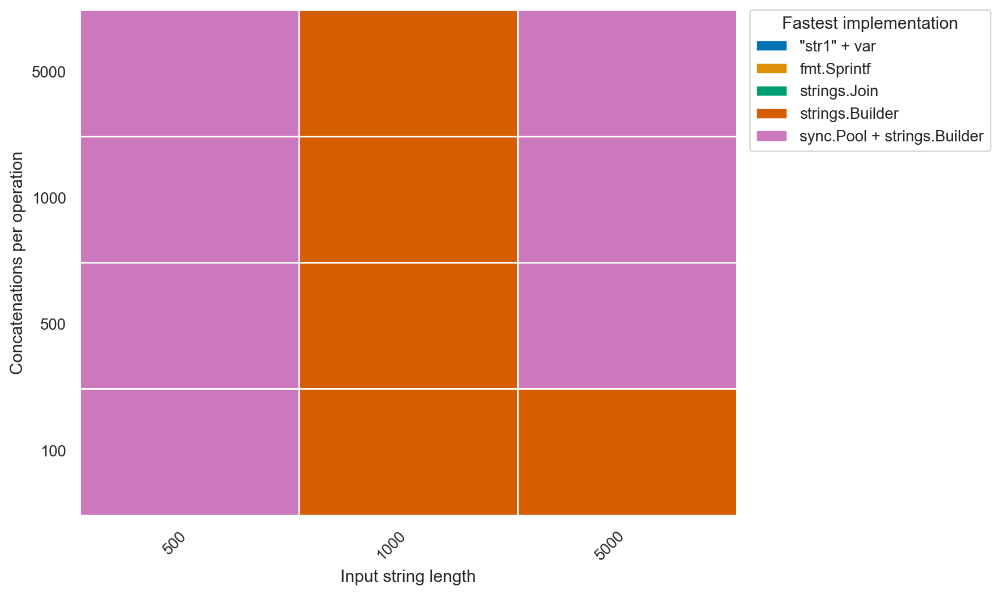
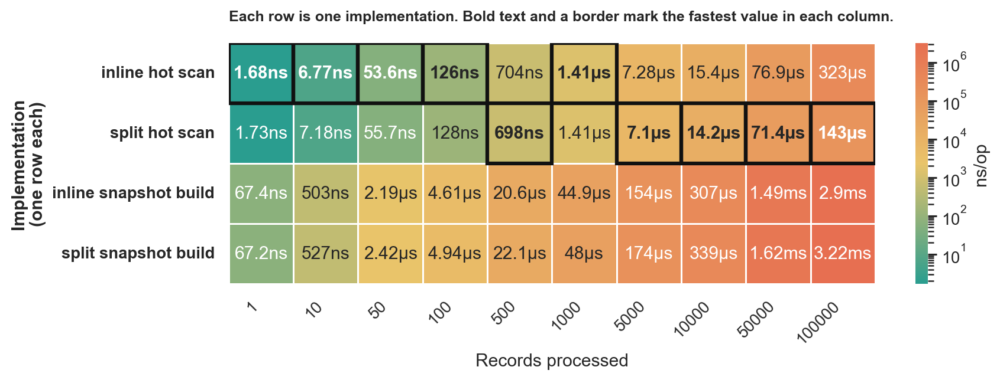
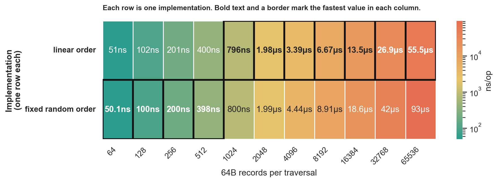

# Rules of thumb for Go

> In English, the phrase "rule of thumb" refers to an approximate method for doing something, based on practical experience rather than theory.

As a software engineer, you likely have a good understanding of data structures and the `Big O` complexities associated with different usage patterns. However, determining the most suitable data structure for your specific use case can be a challenging decision.

Often, you'll find yourself in a situation where you need to weigh the benefits of creating a new data structure optimized for your access pattern. The question then arises: when is it worthwhile to invest the effort in building a custom data structure?

The decision isn't as simple as solely relying on `Big O` notation, which primarily reflects time complexity. Real-world performance depends on various factors, such as memory locality, the number of allocations, pointer chasing, and more.

## General rules of thumb that always apply

Always KISS (keep it simple, stupid).

1. make it work
2. make it right
3. make it fast

## Disclaimer

❗These rules are not a dogma! Please don't link to this document saying "you should use this because rules-of-thumb says so". Always measure and benchmark your own code with your own data.

Examples here are what is called micro-optimization, before diving into these, profile your code, find real bottlenecks, and fix low hanging fruit there first.

Published cross-variant benchmark results use deterministic fixtures derived from each case's parameters, so separate `go test` runs still compare identical inputs.
## Needle in a haystack

When is it more efficient to convert a _slice_ into a _map_ for locating an element `x` within the set `A` (x ∈ A)?

> [!TIP]
> use `slice` for one-off checks and up to ~50 lookups  
> switch to `map` when you are doing hundreds of lookups on the same haystack  
> between ~50 and ~100 lookups, benchmark your real workload

Depending on size of the _haystack_ (size) and number of _needles_ (iterations), this will differ:

[Detailed line view](assets/BenchmarkNeedleInAHaystack-detail.png)

In this benchmark, `slice` wins every `10`-lookup case and still wins much of the `50`-lookup region. `map` takes over most of the grid once lookups reach `100+`, but the exact crossover still depends on both the haystack size and how many lookups you amortize the map build across.

[Benchmark results](assets/BenchmarkNeedleInAHaystack.txt)
## Deduplication

When is it more efficient to deduplicate a `slice` as opposed to using a `map[]struct{}` for the same purpose?

> [!TIP]
> if order does not matter, use in-place sort + dedup through at least ~5000 items  
> around `10000` items, benchmark `map` against sort + dedup on your workload  
> if you must preserve original order, use `map`

In this benchmark, in-place sort + dedup is the fastest option from `10` through `5000` items, and `10000` items is effectively a wash with a slight edge to `map`. The plain slice scan is never the fastest path here; it is a simplicity choice for very small inputs, not a performance choice.

[Benchmark results](assets/BenchmarkDeduplication.txt)
## Subsets

When checking if **A** is subset of **B** (A ⊆ B), when is it more efficient to iterate both slices in nested loop `A x B` `O(n^2)`, and when does it make sense to use `map`, or `sort` + binary search?  
Meaning of `A ⊆ B` in this test is that _all_ elements of **A** are present in **B**, regardless of position.

> [!TIP]
> if `len(A) <= 100`, start with nested loops  
> if `len(A) >= 500 && len(B) >= 1000`, use `map`  
> use `sort + binary search` only in the middle, or when `B` is already sorted

[Detailed line view](assets/BenchmarkSubset-detail.png)

The measured crossover is mostly driven by the size of `A`: small subsets keep the nested loop competitive for surprisingly long, while `map` dominates once both sides are non-trivial. `sort + binary search` only wins a narrow middle band in this benchmark, so it is best treated as a special-case option rather than a default.

[Benchmark results](assets/BenchmarkSubset.txt)
## Append

> [!TIP]
> use `append(dst, src...)` as the default  
> if `len(src)` is comparable to or larger than `len(dst)` and this is hot code, preallocate the full result  
> avoid `for` + `append` without preallocation

In this benchmark, `append(dst, src...)` wins most of the grid, especially when the appended slice is small. Once the appended slice gets large relative to the destination, the preallocated indexed copy often pulls ahead, so "append is always fastest" is too strong a rule.

[Detailed line view](assets/BenchmarkAppend-detail.png)

[Benchmark results](assets/BenchmarkAppend.txt)
## Strings concatenation

Is it more efficient to `"str1" + var`, `fmt.Sprintf()`, `strings.Join()` or `strings.Builder`? When does it make sense to add `sync.Pool`?

> [!TIP]
> for repeated concatenation, start with `strings.Builder`  
> treat `sync.Pool + strings.Builder` as a niche large-case optimization and benchmark it on your real workload  
> use `+` for one-off expressions and `fmt.Sprintf` for formatting, not concat speed
>
> in these benchmarks, plain `strings.Builder` is the safest default and `sync.Pool` does not reduce allocation totals

[Detailed line view](assets/BenchmarkConcat-detail.png)

On the main reduced matrix, `strings.Builder` wins the geomean and stays ahead in most cases. `sync.Pool + strings.Builder` does take a few isolated cells, but not enough to support a general threshold rule, so it still belongs in the "benchmark this exact workload" bucket.

[Benchmark results](assets/BenchmarkConcat.txt)

`strings.Builder.Reset()` currently discards the backing buffer, so pooling the builder does not preserve capacity here and does not lower `B/op`. This benchmark is measuring `sync.Pool` overhead around the builder, not reusable builder storage.

For the removed large-size region, a separate large-case-only matrix keeps the run practical while still checking whether pooling can help once the total bytes per operation get very large.

[Detailed large-case line view](assets/BenchmarkConcatLarge-detail.png)

In that large-case matrix, `sync.Pool + strings.Builder` does win several `500` to `5000` byte cases at `500+` concatenations per operation, but it still increases or matches allocations, so it should stay an opt-in benchmark target rather than a default recommendation.

[Large-case benchmark results](assets/BenchmarkConcatLarge.txt)
## If vs switch

Is there even any difference? In theory, `switch` should be faster (at least for some types) if the
compiler is able to transform it into a jump table.

> [!TIP]
> use whichever is more readable  
> when hits are usually the first case, `if` stays competitive and often wins  
> on this benchmark, `switch` usually wins once misses or later/mixed hits are common, especially by `9` cases

[Detailed line view](assets/BenchmarkIfSwitch-detail.png)

[Benchmark results](assets/BenchmarkIfSwitch.txt)

This benchmark compares dense integer equality chains of `3`, `5`, and `9` cases across six deterministic input patterns: `first`, `middle`, `last`, `miss`, `cycle`, and `random`.

There is no single winner. `if` only clearly leads on `first` hits and stays roughly tied on the shorter chains, while `switch` pulls ahead on most `miss`, mixed, and later-hit workloads. By `9` cases, `switch` wins every workload except `first`, often by a wide margin; by `5` cases, the result is already split between `if` on `first` and `switch` on `miss`, `cycle`, and `random`. So the old “longer linear chains favor `if`” conclusion does not hold on these measurements.

This benchmark shows measured behavior for these dense integer chains on this toolchain and hardware. It does not establish which compiler lowering strategy produced the result.

Read more:

- <https://github.com/golang/go/issues/5496>
- <https://github.com/golang/go/issues/19791>
- <https://github.com/golang/go/issues/10870>
- <https://go-review.googlesource.com/c/go/+/357330>
- <https://go-review.googlesource.com/c/go/+/395714>
## Negative space programming (a.k.a. asserts everywhere)

What is the cost of adding `assert`? Does it make any significant impact?

> [!TIP]
> use `assert` freely outside hot loops  
> in hot loops, plain `assert` is near-free below ~10 checks and noticeable around ~100+ checks  
> avoid `defer`-based asserts in hot loops

The absolute times are still small, but the relative cost shows up clearly in a tight loop: plain `assert` is about `1.01x` at `1`-`10` checks and about `2.1x` by `100`-`1000` checks, while `defer`-based asserts are worse. That makes direct asserts fine for most code, but worth avoiding in very hot inner loops.

[Benchmark results](assets/BenchmarkAssert.txt)

Read more:

- <https://spinroot.com/gerard/pdf/P10.pdf>
- <https://github.com/tigerbeetle/tigerbeetle/blob/main/docs/TIGER_STYLE.md#safety>
- <https://alfasin.com/2017/12/21/negative-space-and-how-does-it-apply-to-coding/>
## Read-only parameter passing: `T` vs `*T`

Should a read-only call boundary take a large payload as `T` or `*T`?

This benchmark is the representative parameter-passing case for this repo. It stands in for either a plain function parameter or a method receiver with the same read-only call shape.
Here, "hot fields" just means the small set of fields the callee actually reads on every call; the benchmark is not modeling whole-record copies.

> [!TIP]
> use `T` up to about `16B`
> around `24-32B`, benchmark your own workload
> on this benchmark, prefer `*T` from about `32B` upward for read-only hot paths
> keep `T` when you specifically want value semantics or isolation

Each benchmark operation runs `256` `//go:noinline` read-only calls over aligned mixed-field structs from `8B` to `512B`, and each call reads only a few scalar fields into a sink accumulator. In these results, `T` is about `6.6%` faster at `8B`, `16B` is effectively a wash, `*T` is about `11%` faster at `24B`, and the gap grows from about `31%` at `32B` to about `195%` at `512B`, so the measured crossover for this call shape is around `24-32B`. This does not measure mutation, whole-record copying, interface dispatch, slice layout, or GC-heavy escaping.

[Benchmark results](assets/BenchmarkParamValueVsPointer.txt)

Further reading:
- [There is no pass-by-reference in Go](https://dave.cheney.net/2017/04/29/there-is-no-pass-by-reference-in-go)
## Owned return values: `T` vs `*T`

Should a function that builds and returns a fresh owned result use `T` or `*T`?

This section is about owned return values and the escape/allocation behavior of returning a freshly built result. It is not a blanket rule for APIs that need shared mutable identity, optional values, or polymorphic nil signaling.

> [!TIP]
> use `T` through at least `512B` for freshly built owned results in this benchmark
> no cutoff appeared before `512B`
> `*T` loses here because it allocates (`256 allocs/op` vs `0`)
> shared mutable identity and optional/nil results are separate API-design concerns

This benchmark builds `256` fresh results per operation from scalar seed inputs. `return T` wins at every tested size from `8B` to `512B`; `return *T` never catches up because it escapes and allocates (`256 allocs/op`, `2KiB/op` to `128KiB/op`) while `return T` stays at `0 allocs/op`.

[Benchmark results](assets/BenchmarkReturnValueVsPointer.txt)

Further reading:
- [There is no pass-by-reference in Go](https://dave.cheney.net/2017/04/29/there-is-no-pass-by-reference-in-go)
## Slice of values vs slice of pointers

Should a read-heavy collection store values (`[]T`) or pointers (`[]*T`)?

This section is about collection layout for read-heavy data, not a blanket rule for API design or parameter passing.
This benchmark has two read patterns: `hot_scan` means walking the collection and reading only a few frequently-used fields, while `snapshot` means building a fresh output slice by copying the full record. It is not a runtime or persistence snapshot.

> [!TIP]
> for wide records with a hot path that only reads a few fields, `[]*T` can win
> in this benchmark, `[]*T` stays ahead through ~`10 000` records on the hot scan, and `[]T` only pulls ahead around ~`100 000`
> for snapshot-style reads that copy most of each record, treat the layouts as roughly tied here and benchmark your own workload
> reach for pointers when you need shared mutation, stable identity, or optional values

This benchmark compares the same wide records in `[]T` and in `[]*T` backed by an equivalent contiguous slice, so it isolates pointer indirection without heap-fragmentation noise. The `hot_scan` row answers "what if I mostly read a small hot prefix of each record?", while the `snapshot` row answers "what if I build and copy whole records?". In these results, hot scans favored `[]*T` by about `7-18%` up to `10 000` records, then `[]T` edged ahead by about `4%` at `100 000`; snapshot builds were effectively tied at `10-1 000`, `[]*T` won at `10 000`, and `100 000` was inconclusive, so the real rule of thumb is to match the layout to the read path rather than assume either representation wins in general.

[Benchmark results](assets/BenchmarkValuesVsPointers.txt)

Further reading:
- [CPU Cache-Friendly Data Structures in Go: 10x Speed with Same Algorithm](https://skoredin.pro/blog/golang/cpu-cache-friendly-go)
- [There is no pass-by-reference in Go](https://dave.cheney.net/2017/04/29/there-is-no-pass-by-reference-in-go)
## Hot/cold split: inline `T` vs `*T` field

Should a mostly-cold sub-struct live inline as `T`, or behind `*T` inside a larger record?

This section is the benchmark-backed answer to "should this field be `T` or `*T` inside a struct?" Here, "hot" means the small set of fields the fast path reads every time, "cold" means bulky fields that are usually present but ignored by that path, and `snapshot` means "build and copy a full output record", not "take a runtime snapshot". The result depends on access pattern: hot-prefix scans and whole-record copies want different layouts.

> [!TIP]
> keep the field inline when callers usually read or copy the whole record  
> split to `*Cold` only when a hot path scans large collections and mostly ignores the cold tail  
> in this benchmark, the split layout starts to win around `5 000` records on the hot-only scan and is clearly better by `10 000+`  
> for full-record snapshots, inline stays better across the whole measured range

This benchmark stores the same records either as one wide inline struct or as a small hot struct pointing at a contiguous cold backing slice. The `hot_scan` row answers "what if the loop only reads the hot prefix and never touches the cold tail?", while the `snapshot` row answers "what if the code needs to assemble and copy the whole record?". In these results, inline is slightly better through `1 000` records on the hot scan, `Hot + *Cold` starts to edge ahead around `5 000`, stays about `7%` faster at `10 000-50 000`, and is about `56%` faster at `100 000`. The snapshot path goes the other way: inline is effectively tied at `1` record and then stays about `5-13%` faster from `10` upward because the full record is already contiguous.

[Benchmark results](assets/BenchmarkHotColdSplit.txt)
## Range over func

With [Go 1.23 came new feature - range over func](https://go.dev/blog/range-functions), lets check when it makes sense to use that over
pre-allocating a slice and putting values in it.

> [!TIP]
> use direct iteration on hot paths  
> use `iter.Seq` when it makes the API or call site cleaner  
> expect `range over func` to stay close on tiny loops and cost about ~15-25% on larger ones  
> materializing a slice is noticeably more expensive because it also pays the slice build cost

In this benchmark, direct iteration still wins at every tested size. `range over func` is effectively a wash on the tiniest loops, then settles around `15-25%` overhead once the loop gets large enough for iterator machinery to show up. Prebuilding a slice is consistently the slowest option here because it pays both the generation work and the slice materialization cost.

[Benchmark results](assets/BenchmarkIterate.txt)
## Array of Structs vs Struct of Arrays

When is it worth splitting a slice of game-style entities into field-parallel slices?

> [!TIP]
> for hot loops over a few fields, use `AoS` when `len(entities) <= 100`  
> for hot loops over a few fields, use `SoA` when `len(entities) >= 1 000`  
> if you usually work with whole records together, keep `AoS`, especially once `len(entities) >= 10 000`

This benchmark uses a game-style entity model with hot physics fields (`position`, `velocity`, `active`) and cold metadata (`name`, `material`, `ai state`).
Here, `hot_update` means "update only the physics fields in place" and never read the metadata, while `snapshot_build` means "assemble a fresh output record with all fields for each active entity". It is a whole-record copy workload, not a runtime snapshot.
In this run, `AoS` wins the hot update at `10` and `100` entities, `SoA` takes over from `1 000` upward, and whole-record snapshot building stays close with `AoS` pulling ahead again at `10 000+`.

[Benchmark results](assets/BenchmarkAoSVsSoA.txt)
## Locality: linear vs randomized access

When does it pay to keep a traversal contiguous instead of visiting the same records in a fixed random order?

This section is about locality and CPU prefetch behavior over the same `O(n)` work, not about changing algorithmic complexity.

> [!TIP]
> for `64B` records, fixed-random order stays ahead through ~`2 048` records in this run
> linear order takes over around ~`4 096` records and keeps widening from there
> by `65 536` records, linear is about `44%` faster here
> treat the `2 048-4 096` crossover as hardware-sensitive and benchmark on your own CPU

This benchmark prebuilds one `[]record` plus two index orders: identity and a fixed permutation. Both variants read the same `64B` records exactly once per pass, sum the same hot fields, allocate nothing, and differ only in access order. In this run, the fixed random walk was about `9-19%` faster from `64` through `2 048` records, then linear pulled ahead at `4 096` and widened to about `13%` at `8 192`, `29%` at `32 768`, and `44%` at `65 536`. The practical rule is not that random access is "better"; locality effects can flip at small working sets, but contiguous layout and traversal order become increasingly valuable once the walk grows past the smallest caches.

[Benchmark results](assets/BenchmarkLinearVsRandomAccess.txt)
## Notes

- More "Rules of thumb" will be added over time.
- Benchmark assets in this worktree were rerun locally on **Apple M5** with **Go 1.26.1**.
- Check the raw files in `assets/` for per-benchmark run metadata and exact `go test` headers.
