# Rules of thumb for Go

> In English, the phrase "rule of thumb" refers to an approximate method for doing something, based on practical experience rather than theory.

As a software engineer, you likely have a good understanding of data structures and the `Big O` complexities associated with different usage patterns. However, determining the most suitable data structure for your specific use case can be a challenging decision.

Often, you'll find yourself in a situation where you need to weigh the benefits of creating a new data structure optimized for your access pattern. The question then arises: when is it worthwhile to invest the effort in building a custom data structure?

The decision isn't as simple as solely relying on `Big O` notation, which primarily reflects time complexity. Real-world performance depends on various factors, such as memory locality, the number of allocations, pointer chasing, and more.

## General rules of thumb that always apply

Always KISS (keep it simple, stupid).

1. make it work
2. make it right
3. make it fast

## Disclaimer

❗These rules are not a dogma! Please don't link to this document saying "you should use this because rules-of-thumb says so". Always measure and benchmark your own code with your own data.

Examples here are what is called micro-optimization, before diving into these, profile your code, find real bottlenecks, and fix low hanging fruit there first.
## Needle in a haystack

When is it more efficient to convert a _slice_ into a _map_ for locating an element `x` within the set `A` (x ∈ A)?

> [!TIP]
> use `slice` for one-off checks and up to ~50 lookups  
> switch to `map` when you are doing hundreds of lookups on the same haystack  
> between ~50 and ~100 lookups, benchmark your real workload

Depending on size of the _haystack_ (size) and number of _needles_ (iterations), this will differ:
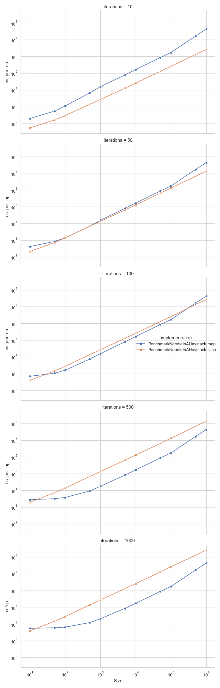

[Detailed line view](assets/BenchmarkNeedleInAHaystack-detail.png)

In this benchmark, `slice` wins every `10`-lookup case and still wins much of the `50`-lookup region. `map` takes over most of the grid once lookups reach `100+`, but the exact crossover still depends on both the haystack size and how many lookups you amortize the map build across.

[Benchmark results](assets/BenchmarkNeedleInAHaystack.txt)
## Deduplication

When is it more efficient to deduplicate a `slice` as opposed to using a `map[]struct{}` for the same purpose?

> [!TIP]
> if order does not matter, use in-place sort + dedup up to ~1000 items  
> use `map` from roughly ~5000 items upward  
> if you must preserve original order, use `map`

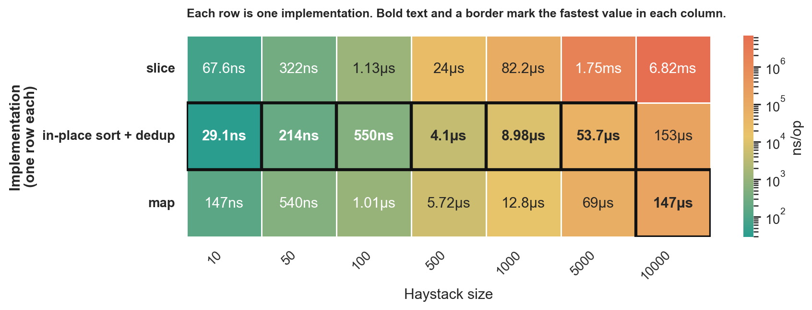

In this benchmark, in-place sort + dedup is the fastest option from `10` through `1000` items, while `map` takes over from `5000` onward. The plain slice scan is never the fastest path here; it is a simplicity choice for very small inputs, not a performance choice.

[Benchmark results](assets/BenchmarkDeduplication.txt)
## Subsets

When checking if **A** is subset of **B** (A ⊆ B), when is it more efficient to iterate both slices in nested loop `A x B` `O(n^2)`, and when does it make sense to use `map`, or `sort` + binary search?  
Meaning of `A ⊆ B` in this test is that _all_ elements of **A** are present in **B**, regardless of position.

> [!TIP]
> if `len(A) <= 100`, start with nested loops  
> if `len(A) >= 500 && len(B) >= 1000`, use `map`  
> use `sort + binary search` only in the middle, or when `B` is already sorted

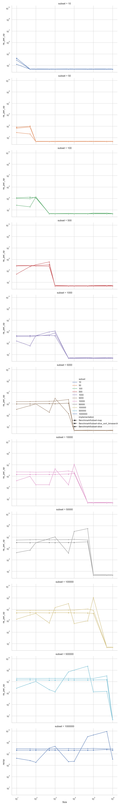

[Detailed line view](assets/BenchmarkSubset-detail.png)

The measured crossover is mostly driven by the size of `A`: small subsets keep the nested loop competitive for surprisingly long, while `map` dominates once both sides are non-trivial. `sort + binary search` only wins a narrow middle band in this benchmark, so it is best treated as a special-case option rather than a default.

[Benchmark results](assets/BenchmarkSubset.txt)
## Append

> [!TIP]
> use `append(dst, src...)` as the default  
> if `len(src)` is comparable to or larger than `len(dst)` and this is hot code, preallocate the full result  
> avoid `for` + `append` without preallocation

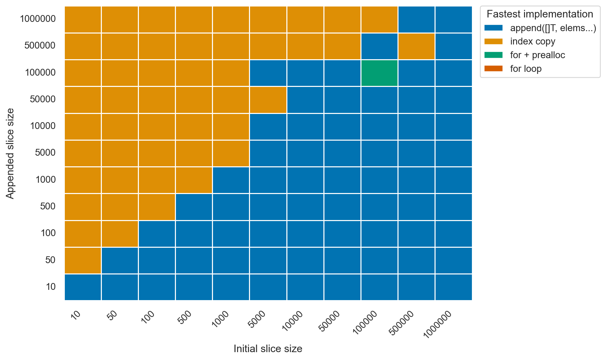

In this benchmark, `append(dst, src...)` wins most of the grid, especially when the appended slice is small. Once the appended slice gets large relative to the destination, the preallocated indexed copy often pulls ahead, so "append is always fastest" is too strong a rule.

[Detailed line view](assets/BenchmarkAppend-detail.png)

[Benchmark results](assets/BenchmarkAppend.txt)
## Strings concatenation

Is it more efficient to `"str1" + var`, `fmt.Sprintf()`, `strings.Join()` or `strings.Builder`? When does it make sense to add `sync.Pool`?

> [!TIP]
> for repeated concatenation, start with `strings.Builder`  
> benchmark `sync.Pool + strings.Builder` once the loop gets very hot or reaches ~1000+ concatenations per operation  
> use `+` for one-off expressions and `fmt.Sprintf` for formatting, not concat speed
>
> in this benchmark, only the `strings.Builder` variants ever win

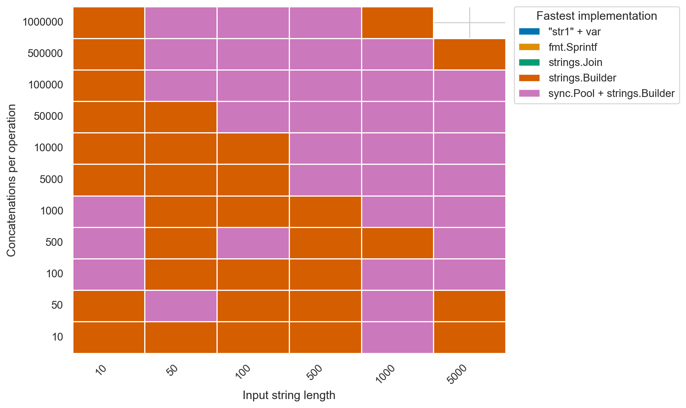

[Detailed line view](assets/BenchmarkConcat-detail.png)

In this benchmark, only the two `strings.Builder` variants take first place. `sync.Pool + strings.Builder` starts to win more often as the work gets heavier, but plain `strings.Builder` stays competitive across the whole grid, which makes it the safest default.

[Benchmark results](assets/BenchmarkConcat.txt)
## If vs switch

Is there even any difference? In theory, `switch` should be faster (at least for some types) if the
compiler is able to transform it into a jump table.

> [!TIP]
> use whichever is more readable  
> for single-case branches, `if` and `switch` are effectively equal  
> for longer linear chains, `if` is slightly to moderately faster in this benchmark

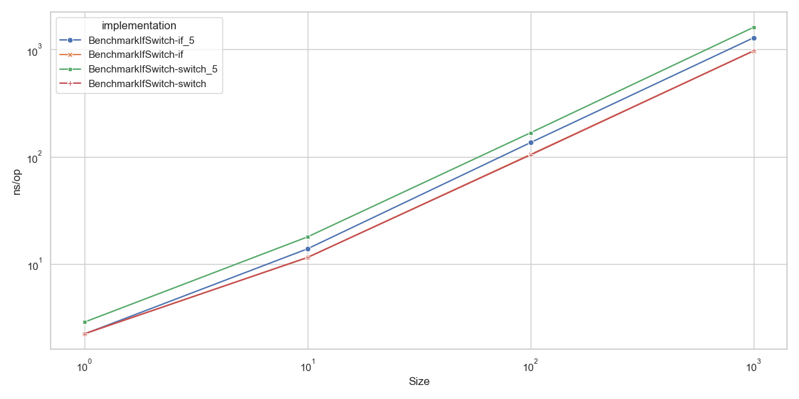

[Benchmark results](assets/BenchmarkIfSwitch.txt)

The 1-case versions are basically a wash here. The 5-case `switch` is consistently slower than the 5-case `if` chain, so the data does not support the idea that `switch` is a free performance win.

It looks like Go does not support jump tables here? The tests I tried compile into same code for both switch/if statements. You can try to hand-roll jump table [similar to the #19791](https://github.com/golang/go/issues/19791).

Read more:

- <https://github.com/golang/go/issues/5496>
- <https://github.com/golang/go/issues/19791>
- <https://github.com/golang/go/issues/10870>
- <https://go-review.googlesource.com/c/go/+/357330>
- <https://go-review.googlesource.com/c/go/+/395714>
## Negative space programming (a.k.a. asserts everywhere)

What is the cost of adding `assert`? Does it make any significant impact?

> [!TIP]
> use `assert` freely outside hot loops  
> in hot loops, plain `assert` is near-free below ~10 checks and noticeable around ~100+ checks  
> avoid `defer`-based asserts in hot loops

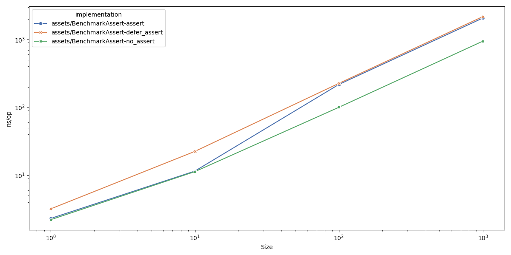

The absolute times are still small, but the relative cost shows up clearly in a tight loop: plain `assert` is about `1.01x` at `1`-`10` checks and about `2.1x` by `100`-`1000` checks, while `defer`-based asserts are worse. That makes direct asserts fine for most code, but worth avoiding in very hot inner loops.

[Benchmark results](assets/BenchmarkAssert.txt)

Read more:

- <https://spinroot.com/gerard/pdf/P10.pdf>
- <https://github.com/tigerbeetle/tigerbeetle/blob/main/docs/TIGER_STYLE.md#safety>
- <https://alfasin.com/2017/12/21/negative-space-and-how-does-it-apply-to-coding/>
## Read-only parameter passing: `T` vs `*T`

Should a read-only call boundary take a large payload as `T` or `*T`?

This benchmark is the representative parameter-passing case for this repo. It stands in for either a plain function parameter or a method receiver with the same read-only call shape.

> [!TIP]
> use `T` up to about `16B`
> around `24-32B`, benchmark your own workload
> on this benchmark, prefer `*T` from about `32B` upward for read-only hot paths
> keep `T` when you specifically want value semantics or isolation

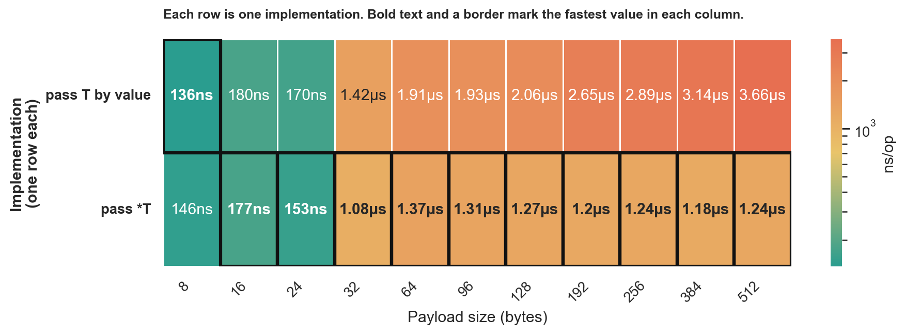

Each benchmark operation runs `256` `//go:noinline` read-only calls over aligned mixed-field structs from `8B` to `512B`, reading only hot fields into a sink accumulator. In these results, `T` is about `6.6%` faster at `8B`, `16B` is effectively a wash, `*T` is about `11%` faster at `24B`, and the gap grows from about `31%` at `32B` to about `195%` at `512B`, so the measured crossover for this call shape is around `24-32B`. This does not measure mutation, interface dispatch, slice layout, or GC-heavy escaping.

[Benchmark results](assets/BenchmarkParamValueVsPointer.txt)

Further reading:
- [There is no pass-by-reference in Go](https://dave.cheney.net/2017/04/29/there-is-no-pass-by-reference-in-go)
## Owned return values: `T` vs `*T`

Should a function that builds and returns a fresh owned result use `T` or `*T`?

This section is about owned return values and the escape/allocation behavior of returning a freshly built result. It is not a blanket rule for APIs that need shared mutable identity, optional values, or polymorphic nil signaling.

> [!TIP]
> use `T` through at least `512B` for freshly built owned results in this benchmark
> no cutoff appeared before `512B`
> `*T` loses here because it allocates (`256 allocs/op` vs `0`)
> shared mutable identity and optional/nil results are separate API-design concerns

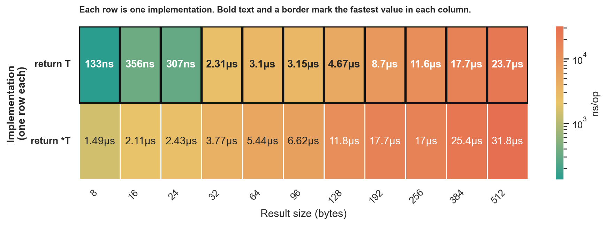

This benchmark builds `256` fresh results per operation from scalar seed inputs. `return T` wins at every tested size from `8B` to `512B`; `return *T` never catches up because it escapes and allocates (`256 allocs/op`, `2KiB/op` to `128KiB/op`) while `return T` stays at `0 allocs/op`.

[Benchmark results](assets/BenchmarkReturnValueVsPointer.txt)

Further reading:
- [There is no pass-by-reference in Go](https://dave.cheney.net/2017/04/29/there-is-no-pass-by-reference-in-go)
## Slice of values vs slice of pointers

Should a read-heavy collection store values (`[]T`) or pointers (`[]*T`)?

This section is about collection layout for read-heavy data, not a blanket rule for API design or parameter passing.

> [!TIP]
> for wide records with a hot path that only reads a few fields, `[]*T` can win
> in this benchmark, `[]*T` stays ahead through ~`10_000` records on the hot scan, and `[]T` only pulls ahead around ~`100_000`
> for snapshot-style reads that copy most of each record, treat the layouts as roughly tied here and benchmark your own workload
> reach for pointers when you need shared mutation, stable identity, or optional values

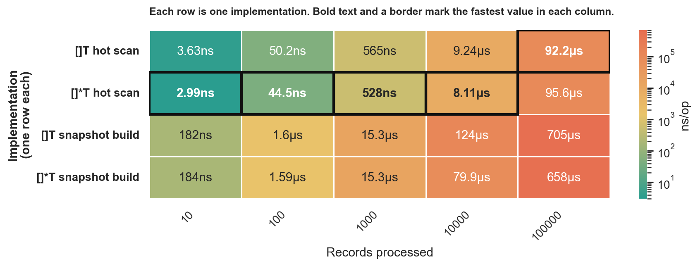

This benchmark compares the same wide records in `[]T` and in `[]*T` backed by an equivalent contiguous slice, so it isolates pointer indirection without heap-fragmentation noise. In these results, hot scans favored `[]*T` by about `7-18%` up to `10_000` records, then `[]T` edged ahead by about `4%` at `100_000`; snapshot builds were effectively tied at `10-1_000`, `[]*T` won at `10_000`, and `100_000` was inconclusive, so the real rule of thumb is to match the layout to the read path rather than assume either representation wins in general.

[Benchmark results](assets/BenchmarkValuesVsPointers.txt)

Further reading:
- [CPU Cache-Friendly Data Structures in Go: 10x Speed with Same Algorithm](https://skoredin.pro/blog/golang/cpu-cache-friendly-go)
- [There is no pass-by-reference in Go](https://dave.cheney.net/2017/04/29/there-is-no-pass-by-reference-in-go)
## Range over func

With [Go 1.23 came new feature - range over func](https://go.dev/blog/range-functions), lets check when it makes sense to use that over
pre-allocating a slice and putting values in it.

> [!TIP]
> use direct iteration on hot paths  
> use `iter.Seq` when it makes the API or call site cleaner  
> expect about ~10-20% overhead on medium and large loops, and more on tiny ones

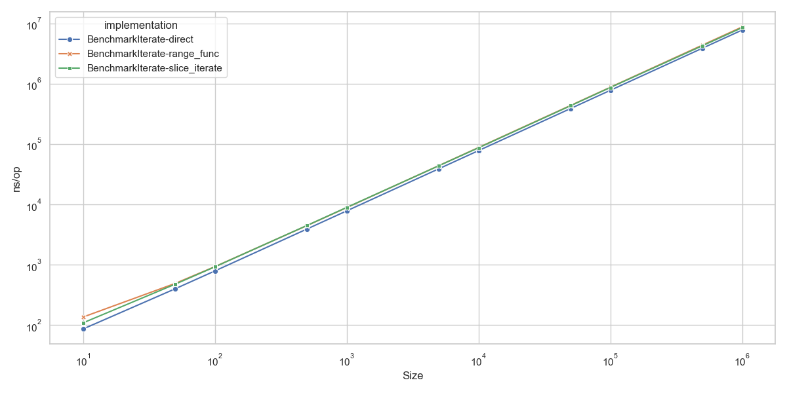

In this benchmark, direct iteration wins at every tested size. `range over func` settles around `12-13%` overhead on medium and large loops, but the penalty is much higher on tiny loops, so the readability trade-off is real but measurable.

[Benchmark results](assets/BenchmarkIterate.txt)
## Array of Structs vs Struct of Arrays

When is it worth splitting a slice of game-style entities into field-parallel slices?

> [!TIP]
> for hot loops over a few fields, use `AoS` when `len(entities) <= 100`  
> for hot loops over a few fields, use `SoA` when `len(entities) >= 1_000`  
> if you usually work with whole records together, keep `AoS`, especially once `len(entities) >= 10_000`

This benchmark uses a game-style entity model with hot physics fields (`position`, `velocity`, `active`) and cold metadata (`name`, `material`, `ai state`).
The `hot_update` workload only touches the hot fields, while `snapshot_build` assembles active entities back into whole records.
In this run, `AoS` wins the hot update at `10` and `100` entities, `SoA` takes over from `1_000` upward, and whole-record snapshot building stays close with `AoS` pulling ahead again at `10_000+`.

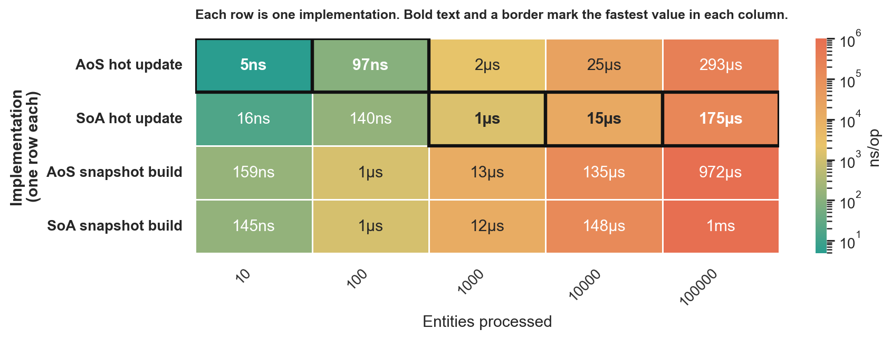

[Benchmark results](assets/BenchmarkAoSVsSoA.txt)
## Notes

- More "Rules of thumb" will be added over time.
- Published results currently mix historical and refreshed runs.
- Many older benchmark assets were collected on a **Macbook Pro M1 (2020) 16GB RAM**, using **Go 1.24.3**.
- Recently refreshed sections in this worktree were rerun locally on **Apple M5** with **Go 1.26.1**; check the raw files in `assets/` for per-benchmark run metadata.
